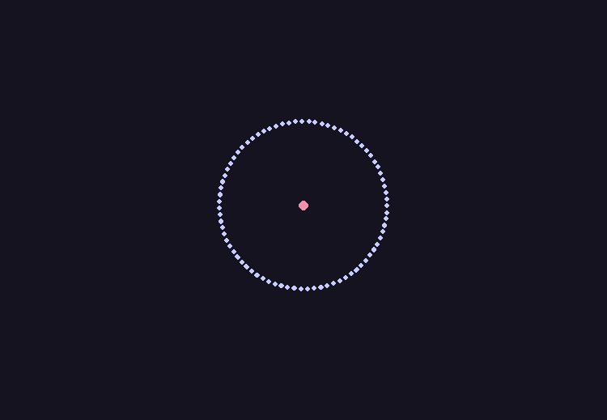

# N-Body Simulation

N-Body Simulation is a common astrophysics simulation, used to model orbiting bodies within a solar system and galaxy. The simulation is done with the integration of Newton's gravitational force equation - calculating the gravitational force between two bodies, which is then used to calculate the new velocity and position using a timestep, `dt`. This is the common brute-force method which runs in $O(n)$ which is good for understanding the concept and forms a basis for more efficient, practical models. The results of the simulation can be visualized in real-time via a graphical interface, which itself is implemented using PyGame.

## Dependencies
- `numpy`
- `pygame`

## Usage

First, make the `run.sh` file executable using `chmod +x run.sh` command. Then, run the file which executes the python program.

```bash
./run.sh
```

Alternatively, run the `nbody.py` file itself by specifying your own command line arguments in the following format:
```bash
python nbody.py <w> <r> <dt> <squeeze> <file>
```
Where:
- `w`: width of the graphical interface.
- `h`: height of the graphical interface.
- `dt`: time-step for the simulation.
- `squeeze`: Integer. Determines how spread out the bodies will be in the graphical interface. Default is 2. Higher the number = closer the bodies.
- `file`: path of the file. See `solarSystem.txt` for example format.

Example:

```bash
python nbody.py 1920 1080 dt 1 data/solarSystem.txt
```

### Data File-Format
```
<number of bodies>
<radius>
<mass> <x> <y> <x-velocity> <y-velocity>
.
.
<mass> <x> <y> <x-velocity> <y-velocity>
```

## Demo





